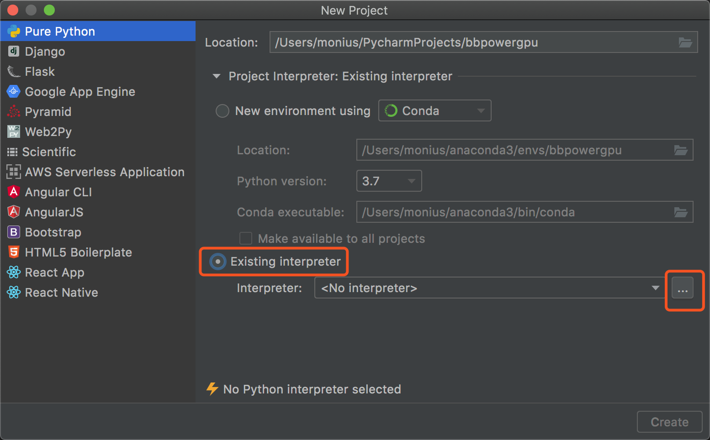
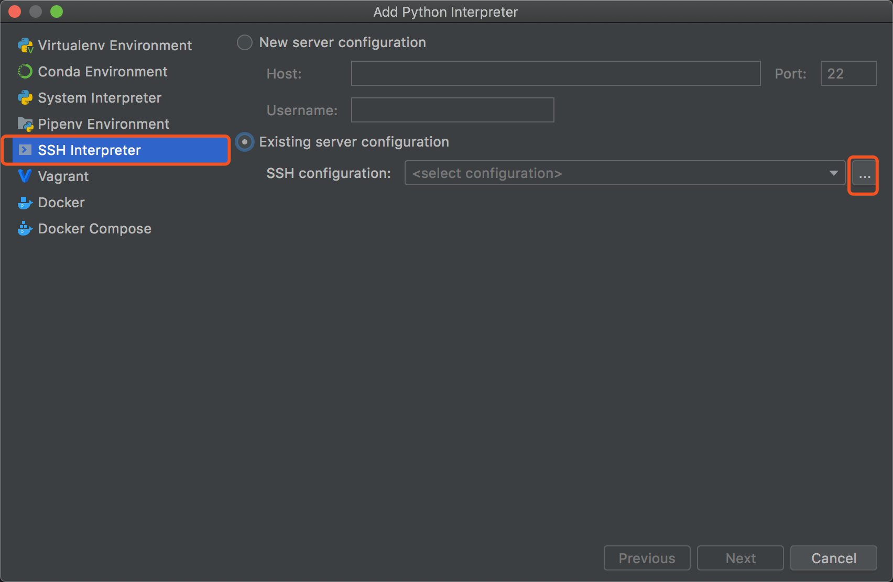
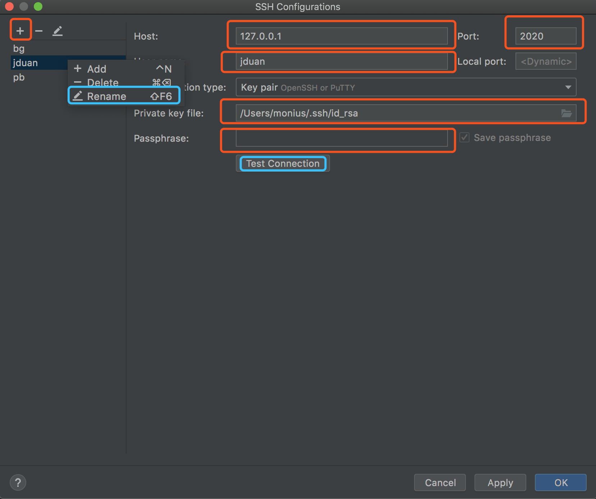
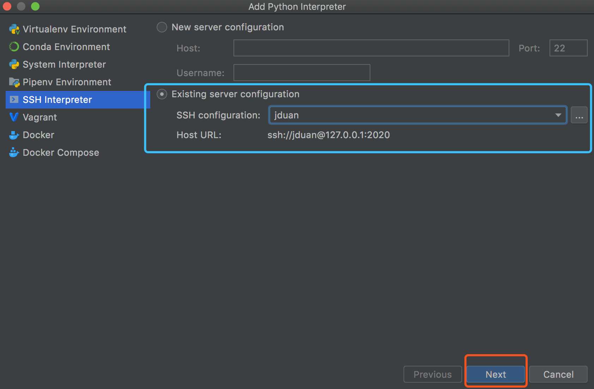

# Using BlueBear in elegant way <sub><small>with pycharm</small></sub>

All of them are supposed to be run on Linux :-).

See: [HowToRunLinuxOnWindows](https://docs.microsoft.com/en-us/windows/wsl/install-win10).

## Only 3 Steps >.<

### 1st step

Add ssh config file on `~/.ssh/config`. *It run on your computer installed pycharm.*

```bash

echo -e " \n \
Host bham \n \
    User jduan \n \
    Hostname tinky-winky.cs.bham.ac.uk \n \
    Port 22 \n \
Host bb \n \
    User jduan \n \
    Hostname bluebear.bham.ac.uk \n \
    Port 22 \n \
    ProxyCommand ssh -q -W %h:%p bham \n \
Host bb2 \n \
    User jduan \n \
    Hostname bb-pg-login02.bear.cluster \n \
    Port 22 \n \
    ProxyCommand ssh -q -W %h:%p bb \n \
" >> ~/.ssh/config
```

Try it:

```bash
ssh bb
```

### 2nd step

Login into the bluebear gateway: `bluebear.bham.ac.uk`.
Add module load scripts into `.bashrc` file.
Create the task sbatch file: `jduan.sh`, and submit the task.

**Run these command**:

```bash
ssh bb
```

```bash
echo -e " if [[ \$(hostname -s) = bear* ]]; then\n \
module purge; module load bluebear;\n \
module load bear-apps/2019b &> /dev/null;\n \
module load PyTorch/1.4.0-fosscuda-2019b-Python-3.7.4 IPython/7.9.0-fosscuda-2019b-Python-3.7.4 Qt5/5.13.1-GCCcore-8.3.0 &> /dev/null;\n \
fi\n \
" >> ~/.bashrc
```

```bash
echo -e " #!/bin/bash \\n \
#SBATCH --job-name=duanj \\n \
#SBATCH --qos bbpowergpu \\n \
#SBATCH --gres gpu:v100:1 \\n \
#SBATCH --cpus-per-task=20 \\n \
#SBATCH --time=00:10:00 \\n \
#SBATCH --mail-type ALL \\n \
module purge; module load bluebear; \\n \
module load bear-apps/2019b; \\n \
module load PyTorch/1.4.0-fosscuda-2019b-Python-3.7.4; \\n \
module load IPython/7.9.0-fosscuda-2019b-Python-3.7.4; \\n \
export XDG_RUNTIME_DIR="" \\n \
port=8080 \\n \
sport=2020 \\n \
/usr/bin/ssh -Nf -R $port:127.0.0.1:$port bb-pg-login02 \\n \
/usr/bin/ssh -Nf -R $sport:127.0.0.1:22 bb-pg-login02 \\n \
nvidia-smi \\n \
echo 2333 \\n \
jupyter notebook --no-browser --port $port --notebook-dir=$(pwd) \\n \
" >> ~/jduan.sh
```

```bash
sbatch jduan.sh
```

### 3rd step

Now on your own computer. **DO NOT LOGIN BLUEBEAR**.
Forward your activate bluebear ssh session port(`2020`) back to your computer.

Note: The port `2020` can be modified in `jduan.sh`. Just change `sport`.

```bash
ssh -L 2020:127.0.0.1:2020 -C -N bb2
```

### Run on Pycharm

**Cool!** Let's remote debug on Pycharm.

Open `Pycharm` and create a new project `bbpowergpu`.



Then, create a new remote `interpreter`.


Add, add a new `ssh` conncetion. Then rename it as `jduan`, selcte it.



Copy `/rds/bear-apps/2019b/EL7-power9/software/Python/3.7.4-GCCcore-8.3.0/bin/python` into it.



All done!

### Run on Vs-code

### Run on Spyder


## Declaration

### Author

Mon-ius [](https://github.com/Mon-ius?tab=followers)

### Test account

jduan

### Additional Materials

[1.SSH Remote Forward](http://www.ruanyifeng.com/blog/2011/12/ssh_port_forwarding.html)
[2.Pycharm Remote Interpreter](https://www.jetbrains.com/help/pycharm/configuring-remote-interpreters-via-ssh.html)

### License
```
MIT License

Copyright (c) 2020 Monius

Permission is hereby granted, free of charge, to any person obtaining a copy
of this software and associated documentation files (the "Software"), to deal
in the Software without restriction, including without limitation the rights
to use, copy, modify, merge, publish, distribute, sublicense, and/or sell
copies of the Software, and to permit persons to whom the Software is
furnished to do so, subject to the following conditions:

The above copyright notice and this permission notice shall be included in all
copies or substantial portions of the Software.

THE SOFTWARE IS PROVIDED "AS IS", WITHOUT WARRANTY OF ANY KIND, EXPRESS OR
IMPLIED, INCLUDING BUT NOT LIMITED TO THE WARRANTIES OF MERCHANTABILITY,
FITNESS FOR A PARTICULAR PURPOSE AND NONINFRINGEMENT. IN NO EVENT SHALL THE
AUTHORS OR COPYRIGHT HOLDERS BE LIABLE FOR ANY CLAIM, DAMAGES OR OTHER
LIABILITY, WHETHER IN AN ACTION OF CONTRACT, TORT OR OTHERWISE, ARISING FROM,
OUT OF OR IN CONNECTION WITH THE SOFTWARE OR THE USE OR OTHER DEALINGS IN THE
SOFTWARE.```
